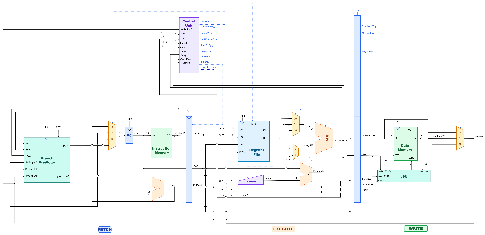

# RV32I Three-Stage Processor

A small, synthesizable SystemVerilog processor with a three-stage fetch, execute, and write pipeline. The core implements an RV32I integer subset and uses a dynamic branch predictor to choose fetch addresses.

## Architecture

| Stage | Main work |
| --- | --- |
| Fetch | Read the instruction at the PC; use the branch predictor to select the next fetch address. |
| Execute | Decode the instruction, read operands, perform ALU operations, calculate branch/jump targets, and resolve branches. |
| Write | Access data memory for loads and stores, then write results to the register file. |

The branch predictor has a 256-entry branch history table with 2-bit saturating counters and a 256-entry branch target buffer. Mispredicted branches and jumps redirect fetch and flush the younger instruction.

## Implemented instructions

- Register ALU operations: `ADD`, `SUB`, `AND`, `OR`, `XOR`, `SLL`, `SRL`, `SRA`, `SLT`, and `SLTU`.
- Immediate ALU operations: `ADDI`, `ANDI`, `ORI`, `XORI`, `SLLI`, `SRLI`, `SRAI`, `SLTI`, and `SLTIU`.
- Loads and stores: `LB`, `LH`, `LW`, `LBU`, `LHU`, `SB`, `SH`, and `SW`.
- Conditional branches: `BEQ`, `BNE`, `BLT`, `BGE`, `BLTU`, and `BGEU`.
- Control flow: `JAL` and `JALR`.
- Upper immediates: `LUI` and `AUIPC`.

This is a non-privileged core. It does not implement privilege modes, CSRs, interrupts, or an exception/trap handler.

## Memories

- Instruction memory contains 2,048 32-bit words (8 KiB), addressed by byte PC.
- Data memory contains 4,096 bytes (4 KiB) and uses little-endian byte lanes.
- Instruction and data images are loaded by the testbenches from `program/machinecode/`.

## Repository layout

| Path | Contents |
| --- | --- |
| `rtl/` | Processor, memories, and branch predictor RTL. |
| `tb/` | SystemVerilog testbenches. |
| `program/assembly/` | Example assembly programs. |
| `program/machinecode/` | Hex instruction and data images used by the testbenches. |
| `docs/` | Datapath and controller diagrams. |

## Authors

- Abdul Rafay
- Haiqua Ghaffar
